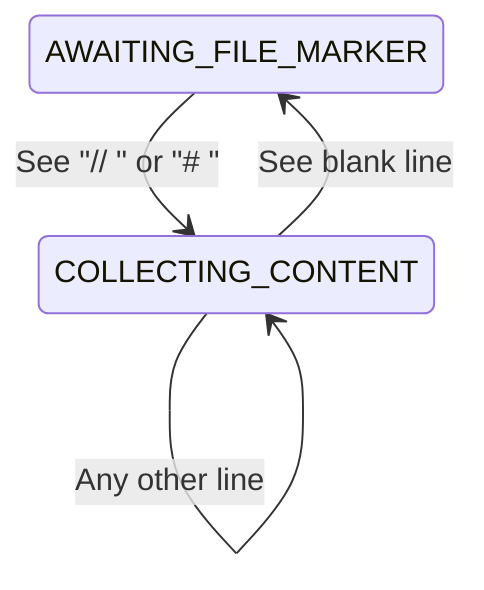

# Claude Artifact Unpacker Technical Documentation

## Architecture Overview

The project generator is implemented as a single Python script with a clear separation of concerns across several key functions. The main processing pipeline follows these stages:

1. Input Processing (stream parsing)
2. File Definition Collection
3. Project Creation
4. Visual Feedback

### Key Data Structures

```python
# File definition tuple
FileDefinition = tuple[str, str]  # (filepath, content)

# Internal representation of collected files
files_to_process: list[FileDefinition]

# Directory cache for tree visualization
current_branches: dict[str, Tree]  # path -> tree_node
```

## Input Processing

### Stream Parser State Machine

The input parser implements a simple state machine that handles both `//` and `#` style markers:

```python
def is_file_marker(line: str) -> bool:
    """Check if a line is a file marker using either # or // syntax."""
    return (line.startswith('// ') or line.startswith('# ')) and not (
        line.startswith('// [') or line.startswith('# [')
    )

def is_placeholder_marker(line: str) -> bool:
    """Check if a line is a placeholder marker using either # or // syntax."""
    return (line.startswith('// [') and line.endswith(']')) or (
        line.startswith('# [') and line.endswith(']')
    )
```

The state transitions are:



### Input Processing Phase

The input processing phase handles both marker styles through helper functions:

```python
def extract_filepath(line: str) -> str:
    """Extract filepath from a marker line, handling both # and // syntax."""
    if line.startswith('// '):
        return line[3:]  # Strip "// "
    elif line.startswith('# '):
        return line[2:]  # Strip "# "
    return line
```

#### Special Cases Handling

1. **Placeholder Content**
   - When a line matches either `// [...]` or `# [...]`, it's treated as placeholder content
   - The placeholder replaces the content of the previous file
   - Example:
     ```text
     // file1.txt
     // [Add content here]

     # file2.txt
     # [Implementation needed]
     ```

2. **Empty Files**
   - Created when no content lines appear between file markers
   - Example:
     ```text
     // empty.txt

     // next-file.txt
     ```

3. **Line Ending Normalization**
   - Input lines have endings stripped with `rstrip('\n')`
   - Content is joined with platform-appropriate line endings

### Memory Efficiency

The parser processes input line by line without loading the entire file into memory:
- Each line is processed immediately
- Content is accumulated only for the current file
- Files are written to disk as soon as they're complete

## Project Creation Phase

The project creation phase handles the actual file system operations and provides visual feedback to the user.

### Processing Phases
1. **Project Directory Creation**
   - Creates root directory using resolved name
   - Handles collisions with existing directories
   - Sets appropriate permissions

2. **File System Operations**
   - Creates all necessary subdirectories
   - Writes files with their content
   - Reports progress for each operation
   - Builds visual tree structure

3. **User Feedback**
   - Shows progress spinner during processing
   - Displays warnings for placeholder content
   - Generates tree visualization of structure
   - Reports any errors or issues

### Directory Resolution

Directory paths are handled using Python's `pathlib` for cross-platform compatibility:

```python
def resolve_directory(filepath: str) -> Path:
    # Convert to Path object for platform-independent handling
    path = Path(filepath)

    # Get directory component
    directory = path.parent

    # Create if doesn't exist
    directory.mkdir(parents=True, exist_ok=True)

    return directory
```

### File Creation Strategy

Files are created using a two-phase approach to ensure atomicity:

1. **Check Phase**
   - Verify parent directory exists/can be created
   - Check for file collisions
   - Validate permissions

2. **Creation Phase**
   - Create parent directories
   - Write file content
   - Set permissions

```python
def create_file(filepath: str, content: str) -> None:
    path = Path(filepath)

    # Phase 1: Checks
    if path.exists():
        raise FileExistsError(f"File already exists: {filepath}")

    # Phase 2: Creation
    path.parent.mkdir(parents=True, exist_ok=True)
    path.write_text(content)
    path.chmod(0o644)  # rw-r--r--
```

## Project Name Resolution

### Package.json Parsing

A lightweight JSON parsing approach is used for package.json:

```python
def extract_name_from_package(content: str) -> Optional[str]:
    """Extract name without full JSON parsing."""
    for line in content.split('\n'):
        if '"name"' in line:
            # Basic extraction with quote and comma handling
            parts = line.split(':')
            if len(parts) >= 2:
                name = parts[1].strip().strip('",')
                return sanitize_name(name)
    return None
```

This approach:
- Avoids loading entire file into memory
- Handles common JSON formatting variations
- Is more forgiving than strict JSON parsing

### Name Generation

Default names are generated with collision detection:

```python
def generate_unique_name(base: str = "project") -> str:
    if not Path(base).exists():
        return base

    counter = 2
    while Path(f"{base} {counter}").exists():
        counter += 1

    return f"{base} {counter}"
```

## Visual Feedback System

### Progress Tracking

The Rich library is used for progress tracking with these key components:

1. **Spinner Column**
   - Shows continuous activity
   - Provides visual feedback even during I/O operations

2. **Progress Bar**
   - Tracks overall file creation progress
   - Updates in real-time

```python
def create_progress() -> Progress:
    return Progress(
        SpinnerColumn(),
        TextColumn("[progress.description]{task.description}"),
        BarColumn(),
        MofNCompleteColumn(),
        TimeElapsedColumn(),
    )
```

### Tree Visualization

The tree structure is built incrementally during file creation:

```python
def update_tree(tree: Tree, filepath: str) -> None:
    parts = Path(filepath).parts
    current = tree

    # Build path incrementally
    for part in parts[:-1]:
        # Cache tree nodes to avoid duplication
        if part not in current_branches:
            current_branches[part] = current.add(
                f"[bold blue]📁 {part}"
            )
        current = current_branches[part]

    # Add file node
    current.add(f"[bold yellow]📄 {parts[-1]}")
```

## Error Handling

### Error Categories

Errors are categorized and handled specifically:

1. **Input Errors** (InvalidInputError)
   - Malformed file markers
   - Invalid file paths
   - Syntax errors

2. **File System Errors** (FileSystemError)
   - Permission denied
   - Disk full
   - Path too long

3. **Runtime Errors** (RuntimeError)
   - Memory exhaustion
   - System resource limits

### Error Recovery

The script implements partial recovery for non-critical errors:

```python
def safe_create_file(filepath: str, content: str) -> bool:
    try:
        create_file(filepath, content)
        return True
    except FileExistsError:
        console.print(f"[yellow]Skipping existing file: {filepath}")
        return True
    except PermissionError:
        console.print(f"[red]Permission denied: {filepath}")
        return False
```

## Performance Considerations

### Memory Management

1. **Streaming Input**
   - Processes input line by line
   - Maintains O(1) memory for file content

2. **Tree Caching**
   - Caches directory nodes
   - Prevents duplicate tree traversal

### I/O Optimization

1. **Directory Creation**
   - Uses `exist_ok=True` to avoid race conditions
   - Caches directory existence checks

2. **File Writing**
   - Uses binary mode for consistent line endings
   - Implements buffered writing for large files

## Testing Considerations

The code is structured to facilitate testing:

1. **Dependency Injection**
   - File system operations are isolated
   - Progress display can be mocked

2. **State Verification**
   - Parser state is explicit
   - File operations are atomic

Example test structure:
```python
def test_file_definition_parser():
    input_stream = StringIO("""
    // file1.txt
    content

    // file2.txt
    // [placeholder]
    """)

    files = process_input(input_stream)
    assert len(files) == 2
    assert files[0] == ("file1.txt", "content")
    assert files[1] == ("file2.txt", "[placeholder]")
```

## Future Considerations

Areas identified for potential improvement:

1. **Parallelization**
   - Parallel directory creation
   - Concurrent file writing

2. **Memory Optimization**
   - Streaming large file content
   - Partial tree visualization

3. **Error Recovery**
   - Transaction-like file creation
   - Rollback capabilities

4. **Extension Points**
   - Plugin system for file processors
   - Custom visualization handlers
